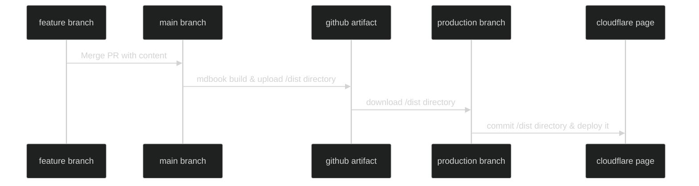

# Deploy mdbook on Cloudflare Page and Github Action
This blog is made with [mdbook](https://github.com/rust-lang/mdBook).
Here is how it is hosted and deployed.

# Infrastructure I use.
- Hosting: Cloudflare Page
- Continuous Deployment: Github Actions


# Overview


# Deployment

Here's a step-by-step breakdown of the workflow.

0. Trigger Workflow: The workflow is triggered when commit pushed on main branch.
1. Checkout: The workflow begins by checking out the repository using the actions/checkout@v4 action. 
2. Setup mdBook: Next, the workflow sets up mdBook (a tool to create online books from Markdown files) using the peaceiris/actions-mdbook@v1 action.
3. Build Docs: The mdbook build -d dist command is then run to compile the Markdown files into a book, placing the output in the `dist` directory. I specified `dist` because default `book` directory is ignored by `.gitignore`.
4. Archive `dist`: The contents of the `dist` directory are then archived using the actions/upload-artifact@v3 action. 
5. Checkout Production Branch: In this step, the workflow checks out the production branch of the repository using the actions/checkout@v4 action. This branch is intended for the deployed version of the book.
7. Download dist: The workflow then downloads the archived dist directory from the previous job using the actions/download-artifact@v3 action.
8. Commit on production branch: The workflow updates the production branch with the new version of book(`dist`).  
9. Cloudflare Pages auto deploy production branch: In cloudflare page settings, choose `production` branch as a deploy branch, `dist` as a build output directory. 


```yml
name: Deployment
on:
  push:
    branches:
      - main
    paths:
      - "src/**.md"
      - "book.toml"
jobs:
  build:
    runs-on: ubuntu-latest
    steps:
      - name: Checkout
        uses: actions/checkout@v4
      
      - name: Setup mdbook
        uses: peaceiris/actions-mdbook@v1
        with:
          mdbook-version: 'latest'

      - name: Build docs
        run: |
          mdbook build -d dist

      - name: Archive dist
        uses: actions/upload-artifact@v3
        with:
          name: dist
          path: dist
  deploy:
    runs-on: ubuntu-latest
    needs: [build]
    permissions:
      actions: write
      checks: write
      contents: write
    steps:
      - name: Checkout production branch
        uses: actions/checkout@v4
        with:
          ref: 'production'

      - name: Download dist
        uses: actions/download-artifact@v3
        with:
          name: dist
          path: dist

      - name: Copy book to production
        run: |
          git config --global user.name 'Github Actions'
          git config --global user.email 'actions@github.com'
          git add .
          git commit -m "Deploy book to production"
          git push
```

