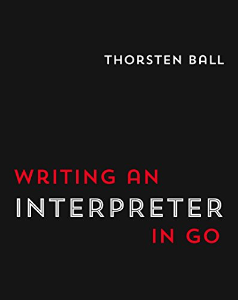
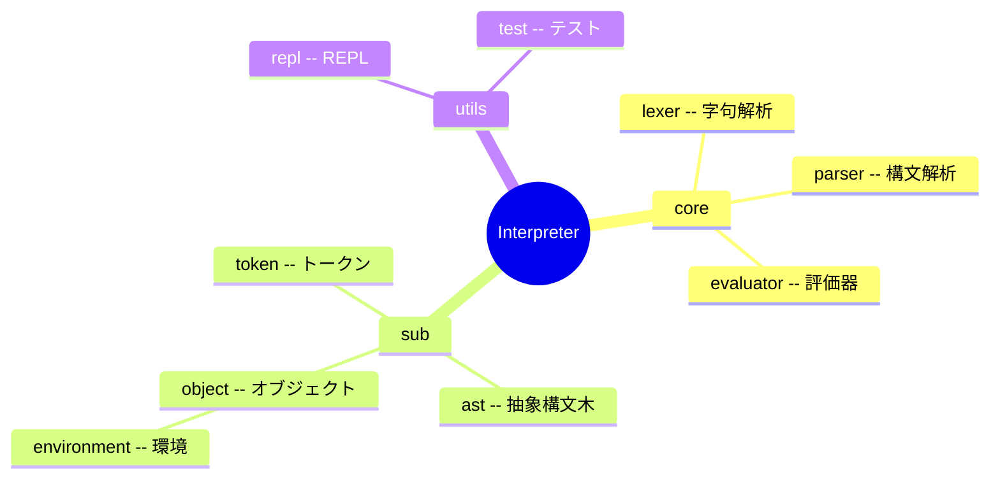

# 2024-04-32 :: Writing a interpreter in Go 感想文


[Writing An Interpreter In Go](https://interpreterbook.com/)

## 概観

当書でつくった interpreter は以下のような構造になっている




## 各モジュールの役割
### Lexical Analysis(字句解析)

ソースコードからトークン列を生成する処理。

```txt
Source Code
|
v ==> Lexical Analysis (字句解析)
|
Tokens
|
v
|
Abstract Syntax Tree             
```


```txt
let x = 5 + 5;
  |
Lexical Analysis  
  |
  v
[
    LET,
    IDENTIFIER("x"),
    ASSIGN,
    INTEGER(5),
    PLUS,
    INTEGER(5),
    SEMICOLON
]
```


### Parse(構文解析)

Tokenを抽象構文木などの構造的なデータに変換する処理

```txt
Source Code
|
v
|
Tokens
|
v ==> Parse(構文解析)
|
Abstract Syntax Tree             
```


### Evaluator

ASTをinputとして、それを何らかの命令として評価する。


```txt
Source Code
|
v
|
Tokens
|
v
|
Abstract Syntax Tree             
|
v ==> Evaluator(評価器)
|
Result
```


### Environment (Object)
TBD

## Parse Strategy について

Pratt Parser という Parse 戦略を採用した。

( TODO: あとでまとめる )


## 開発の流れで印象的だったこと

### 最初にREPLをつくる
まっさきにREPLをつくって、手軽にデバッグできる環境をつくった。
個人的にはこれのおかげで学習のテンションがあがって楽しかった。

特に作ったことがないものをつくるとき「まず小さな機能をE2Eで動かすこと」を目指すのは、モチベ管理のために重要だと感じた。


### 徹底してUnitテストを書く
徹底してテスト駆動開発を行うスタイルだった。

- カバーしなければいけないinputの範囲も膨大、REPLで挙動を把握するのも面倒なので、テスト駆動で書くのは合理的。
- 小さいモジュールを積み重ねていって、最終的に1つの言語をつくるので テストなしでは挙動を管理しきれない。


## References
- [Writing An Interpreter In Go](https://interpreterbook.com/)
- [Github](https://github.com/mori5321/monkey)
